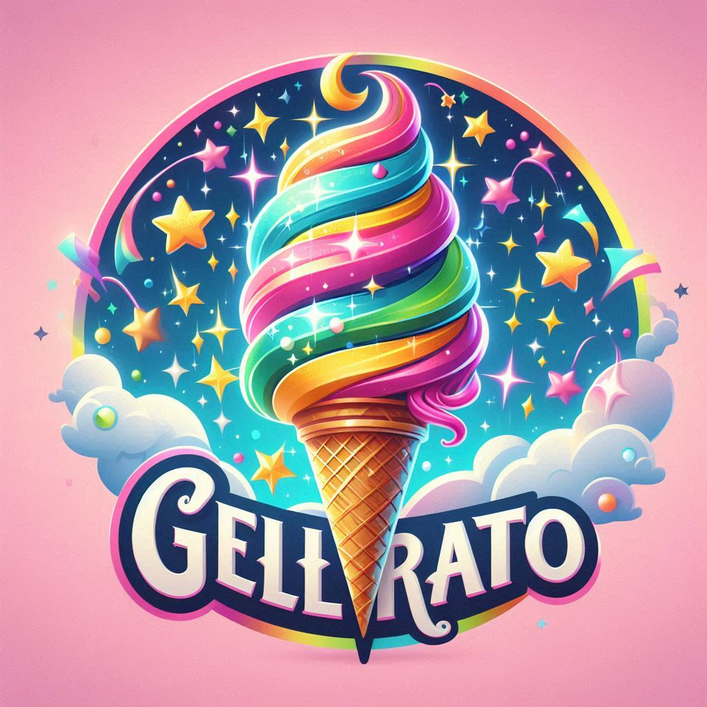
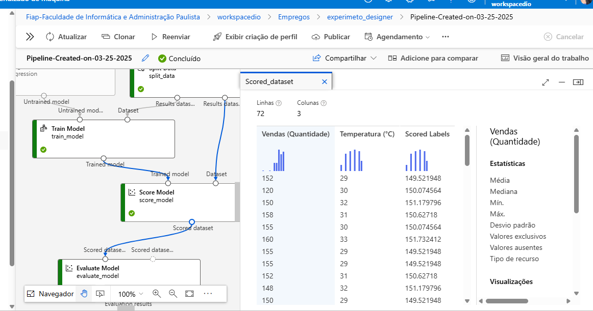

# **Gelato Mágico 🍦✨**
## **Prevendo Vendas de Sorvete com Machine Learning**

### **Introdução**
Bem-vindo ao meu projeto de Machine Learning! Neste desafio, desenvolvi um modelo preditivo para otimizar a produção de sorvetes com base na temperatura do dia, ajudando sorveterias como a Gelato Mágico a minimizar desperdícios e maximizar lucros.

### **Objetivo**
- Criar um modelo de regressão preditiva usando Machine Learning.
- Implementar o modelo em ambiente de cloud computing para previsões em tempo real.
- Gerenciar o modelo com MLflow para garantir organização e rastreabilidade.
- Desenvolver pipelines estruturados para treinamentos e testes reprodutíveis.

### **Tecnologias Utilizadas**
- **Python**: Pandas, scikit-learn, Matplotlib, Seaborn.
- **MLflow**: Para gerenciamento do modelo.
- **Cloud Computing**: Para garantir escalabilidade e previsões em tempo real.

### **Estrutura do Projeto**
- **`inputs`**: Dados brutos de temperatura e vendas diárias.
- **Treinamento do Modelo**: Pipeline que analisa a correlação entre temperatura e vendas e treina o modelo de regressão.
- **Visualizações**: Gráficos que mostram insights, como a relação entre aumento de temperatura e maior venda de sorvetes.
- **Implementação**: O modelo foi registrado e disponibilizado para previsões em tempo real na nuvem.

### **Insights e Aprendizados**
- A temperatura tem uma forte correlação positiva com as vendas de sorvetes.
- Planejamento baseado em dados pode reduzir desperdícios em até 25% e aumentar eficiência produtiva.
- Utilizar MLflow foi essencial para rastrear versões do modelo e promover transparência.

